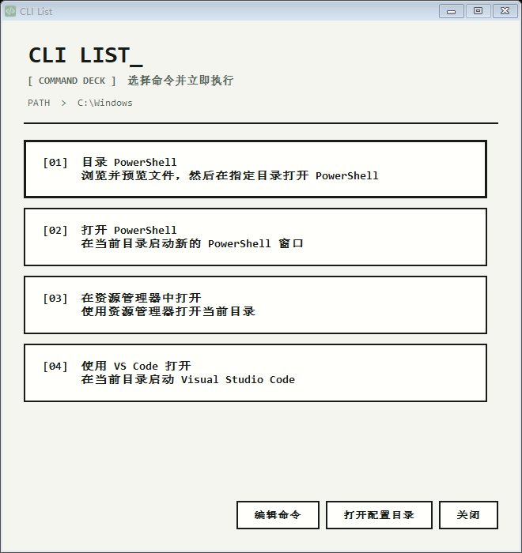

# CLI List

CLI List 是一个面向 Windows 的轻量命令面板。它会在资源管理器右键菜单中添加 `CLI List`，让你从当前目录快速执行常用脚本、打开 PowerShell，或进入带文件预览的目录选择器。



## 核心能力

- 在桌面、目录、文件和磁盘的右键菜单中打开命令面板。
- 通过 `commands.json` 管理可执行命令，无需重新编译。
- 在当前目录直接启动 PowerShell 或其他 CLI。
- 浏览目录并预览文本、代码与常见图片。
- 提供桌面快捷方式和 `cli-list` 终端命令。
- 使用极简像素风界面与多尺寸 Windows 图标。

## 技术栈

- C# / Windows Forms
- PowerShell
- .NET Framework 4.x 自带编译器
- Windows 注册表 Shell 菜单

## 环境要求

- Windows 10 或 Windows 11
- Windows PowerShell 5.1 或 PowerShell 7
- .NET Framework 4.x
- Microsoft Edge（仅构建图标时使用）

## 快速开始

以管理员身份打开 PowerShell，进入项目目录：

```powershell
Set-ExecutionPolicy -Scope Process Bypass
.\build.ps1
.\test.ps1 -SkipBuild
.\install.ps1
```

安装完成后，可以通过以下入口启动：

- 在桌面、文件夹或文件上右键，选择 `CLI List`。
- 双击桌面的 `CLI List` 快捷方式。
- 在终端中执行 `cli-list`；如命令不可用，请将 `%USERPROFILE%\bin` 加入 `PATH`。

程序安装到 `%USERPROFILE%\.cli-list`。重复安装默认保留已有 `commands.json`；需要覆盖配置时执行：

```powershell
.\install.ps1 -ReplaceConfig
```

## 配置命令

编辑 `%USERPROFILE%\.cli-list\commands.json`。普通命令示例：

```json
{
  "Name": "打开 PowerShell",
  "Description": "在当前目录启动 PowerShell",
  "Executable": "%SystemRoot%\\System32\\WindowsPowerShell\\v1.0\\powershell.exe",
  "Arguments": "-NoExit",
  "WorkingDirectory": "{context}",
  "CloseAfterLaunch": true
}
```

`{context}` 表示打开 CLI List 时所在的目录。内置动作 `BrowsePowerShell` 用于打开目录浏览与文件预览窗口。

## 卸载

以管理员身份运行：

```powershell
.\uninstall.ps1
```

卸载会移除右键菜单、桌面快捷方式和终端命令，配置目录仍会保留。

## 当前状态

项目已经可以构建、安装和日常使用，当前重点是完善配置体验与发布流程。功能状态和后续计划见：

- [功能清单](docs/feature-list.md)
- [开发记录](docs/work-roadmap.md)
- [后续计划](docs/plan-list.md)
- [文档维护规范](docs/doc-maintenance.md)

## 许可证

[MIT](LICENSE)
